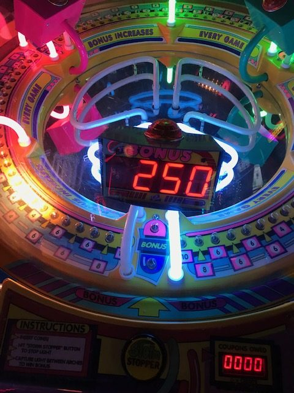

# Final Project Report

## System Overview
The project implements an embedded system leveraging an FPGA-based SoC platform to control various hardware components in order to re-create the classic led stop aracde game pictured below. 

The system integrates:
- A **PWM RGB controller** for LED control.
- An **ADC driver** for input from analog sensors.
- A **stop button module** with debouncing functionality.
- A **WS2811 LED strip driver** for visual output.

# Custom Components

## PWM RGB Controller
The **PWM RGB Controller** enables precise control of an RGB LED by managing duty cycles for each color (Red, Green, Blue) and adjusting the PWM base period.

**Memory-Mapped Registers**:
- `duty_red`, `duty_green`, `duty_blue`: Control individual color duty cycles.
- `base_period`: Sets the overall PWM cycle duration.

**Input/Output**:
- GPIO pins are assigned for RGB output.

## Stop Button Module
The **Stop Button Module** is designed to detect button presses with additional features for input stabilization:
- **Debouncer**: Removes noise from the button signal.
- **Synchronizer**: Aligns the signal to the clock domain.
- **One-Pulse Generator**: Ensures single registration of each press.

**Memory-Mapped Registers**:
- `stop_button`: Indicates button state.

**Input/Output**:
- Connected to a GPIO pin for input.

## Conclusion
This project successfully recreated the classic led stop arcade game. We demonstrated the integration of FPGA-based HDL components with Linux kernel drivers to create a versatile system. 

**Improvements for the Course**:
1. Make git workflow simpler for final project
2. Common errors listings or discord server
