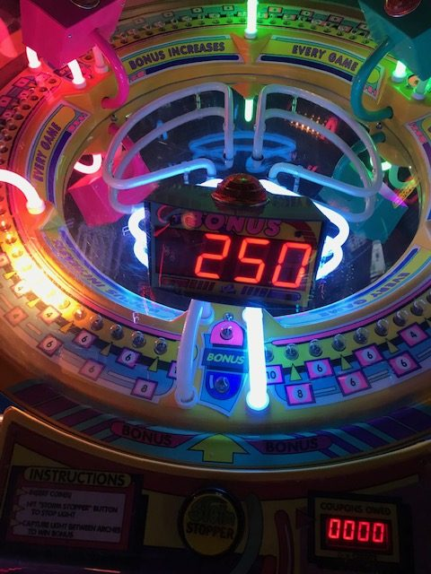

## Our Vision:
This is a rip-on of a classic arcade game: a strip of LEDs makes a big circle around which a few LEDs rotate at a speed adjustable by the potentiometer. A user tries to press a button while the LEDs are lit in a specific place. If they succeed, the LEDs stop for a breif moment and a buzzer goes off before the game resets. 

## David's HW/SW Proposal
HW: Button (stop) and Potentiometer (speed) and Buzzer (success)
SW: Logic for stopping game, playing buzzer, changing speed

## Peter's HW/SW Proposal
HW: WS2811 driver for LED strip
SW: C to run the LEDs (speed of pattern is adjustable)

## Division of labor
HW: Peter will write the VHDL for the WS2811 driver, and David will write the VHDL for the button and potentiometer and buzzer
SW: Peter will write the C for determining success/fail on button press, and David will write the C to run patterns on the LED strip
